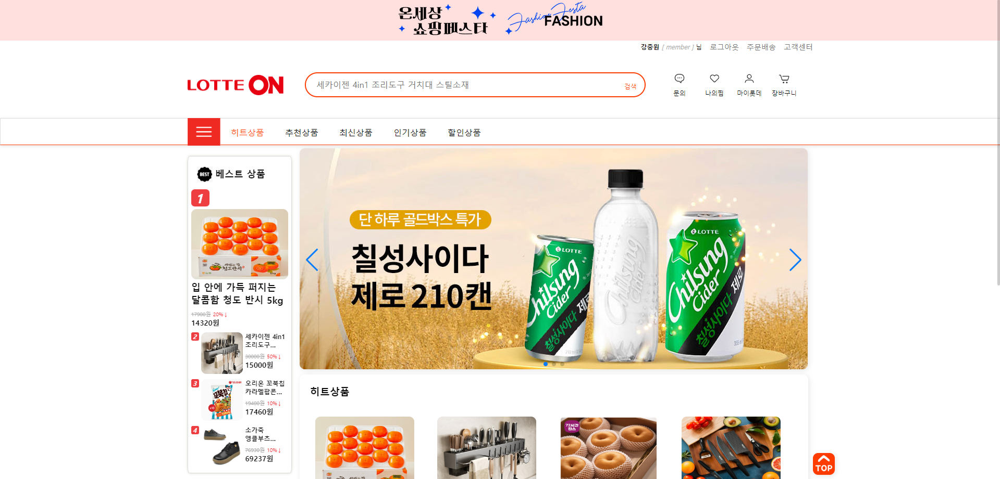
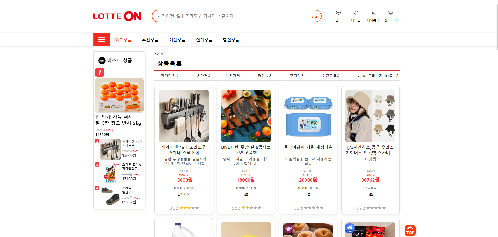
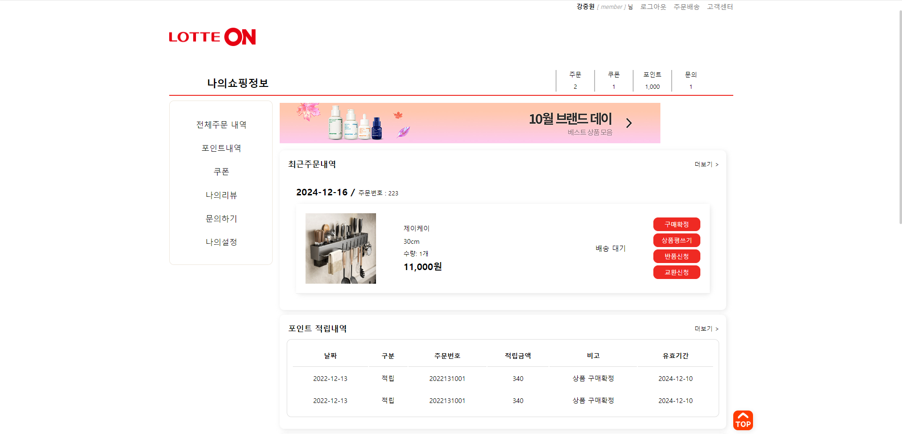
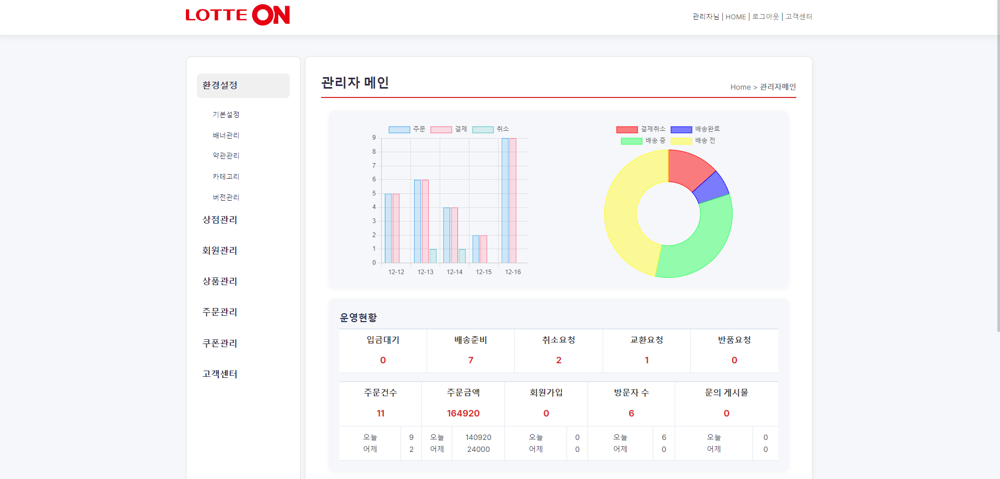

# LotteOn : 롯데e-커머스 LOTTE ON 쇼핑몰


---

## 🛠️ 프로젝트 개요

### 📋 프로젝트 소개

롯데e-커머스에서 실제 개발하는 있는 MSA기반으로 쇼핑몰을 제작하는 프로젝트입니다.
자바 및 스프링 프레임워크를 이용하여 쇼핑몰에 필요한 기능들을 추가하며 쇼핑몰을 구축하였습니다.
---

### 👨‍💻 개발 인원 및 기간
- **개발 인원**: 5명  
- **개발 기간**: 2024.10.14 ~ 2024.11.20 (20일)  

---

### 📌 담당 역할
- **Product 기능**: 상품목록 및 장바구니
- **Main화면** : 각각의 상품과 배너 게시글 불러오기
---

### 🏆 성과 및 결과
- 기한 내 프로젝트 목표 기능 100% 구현
- 배포 및 서비스 테스트 완료 (안정성 확인)

---

## 💻 사용 기술

| **분야**       | **기술 스택**                                               |
|----------------|------------------------------------------------------------|
| **Frontend**   | HTML, CSS, JavaScript                                       |
| **Backend**    | Spring Boot, JPA, QueryDSL, MyBatis                         |
| **Database**   | MySQL                                                      |
| **Deploy**     | AWS (EC2)                                                  |
| **Versioning** | Git                                                        |
| **CI/CD**      | GitHub Actions                                             |

---

## 🌟 주요 기능

1. **메인 페이지**
   - 히트, 추천, 최신, 인기, 할인 상품 스크롤에 따른 비동기 표시
   - 광고 배너 표시
   - 상품 판매량에 따른 웹 소켓을 사용하여 실시간으로 반영되는 베스트 상품 표시
   - 상단 메뉴 클릭 시 해당 위치로 이동 (스무스 스크롤)

2. **상품 페이지**
   - 상품 카테고리에 따른 상품 리스트
   - 상품 검색
   - 조건에 따른 정렬
   - 장바구니 추가, 구매

3. **회원 기능**
   - 로그인, 소셜 로그인
   - 일반/판매자 회원가입
   - 이메일 인증 및 유효성 검사

4. **판매자 페이지**
   - 판매자의 상품 등록과 등록한 상품의 상품추가
   - 상품 관리
   - 쿠폰 발급, 관리

5. **관리자 페이지**
   - 상품 상태와 쇼핑몰에 관한 정보 확인
   - 배너, 카테고리, 버전 관리
   - 상점과, 회원 관리
   - 주문, 쿠폰 관리
   - 고객센터 문의 답변

6. **마이페이지**
   - 최근 주문, 포인트, 쿠폰, 나의 리뷰, 나의 문의 내역 확인
   - 나의 설정 변경

---

## 🚀 설치 및 실행

1. **로컬 개발 환경 설정**
   - Git 리포지토리 클론:
     ```bash
     git clone https://github.com/your-repo/farmstory.git
     ```
   - 데이터베이스(MySQL) 설정
   - Spring Boot 및 프론트엔드 환경 구성

2. **애플리케이션 실행**
   - **실행**: Spring Boot 애플리케이션 실행

---

## 🤝 기여하기

Farmstory 프로젝트에 기여하고 싶으신 분은 다음 단계를 따라주세요:
1. 리포지토리 포크하기
2. 새로운 기능 추가 또는 버그 수정
3. Pull Request 제출

---

## 📫 문의하기
LotteOn 프로젝트에 대해 궁금한 점이 있으시면 언제든지 연락해 주세요!
- **Email**: noily4748@gmail.com

---

## 🖼️ 스크린샷

### 메인 페이지


### 상품 페이지


### 마이 페이지


### 관리자 페이지



---

✨ **LotteOn 프로젝트에 관심을 가져주셔서 감사합니다!** ✨
# LotteOn
